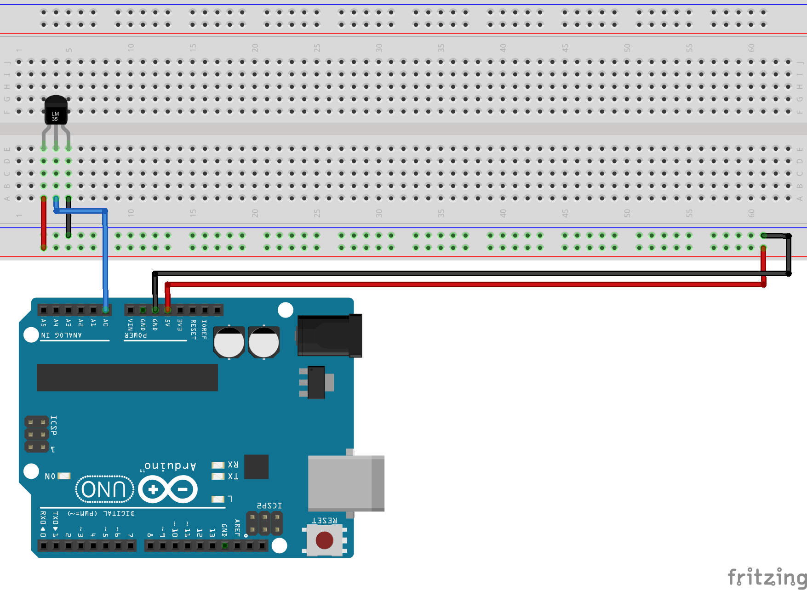

Ini adalah tulisan pertama di blog ini yang membahas tentang hardware dan yang pertama menggunakan bahasa Indonesia. Sensor temperatur LM35 ([datasheet](http://www.ti.com/lit/ds/symlink/lm35.pdf)) adalah sensor IC (Integrated Circuit) yang memberikan respon terhadap perubahan temperatur di sekitarnya dalam bentuk keluaran tegangan analog. Sensor temperatur LM35 bekerja pada tegangan 4 sampai 30V dan mempunyai respon linear 10mV/derajat Celcius pada rentang -55 sampai 150 derajat Celcius berdasarkan datasheet yang tersedia. Akuisisi data menggunakan sensor temperatur ini adalah percobaan sederhana yang bisa dikembangkan untuk perangkat [Internet of Thing](http://whatis.techtarget.com/definition/Internet-of-Things). Garis besar percobaan ini adalah keluaran dari sensor LM35 dibaca oleh Arduino melalui pin input analog (**A0**). Pin input analog Arduino mengeluarkan nilai dengan resolusi 10 bit untuk rentang 0 sampai 5V. Untuk mengetahui tegangan keluaran dari sensor LM35, diperlukan perhitungan berikut ini,

    tegangan_keluaran_lm35 = input_analog_A0 * 5V / 1024

kemudian untuk mengetahui temperatur yang terukur dari sensor LM35, diperlukan perhitungan berikut,

    temperatur_terukur = tegangan_keluaran_lm35 / (10mV/derajatC)

Berikut ini adalah skematik untuk rangkaian LM35 dan Arduino UNO (dibuat dengan software open-source [Fritzing](http://fritzing.org/))

Berikut ini adalah program Arduino yang di-upload ke dalam mikrokontroler Arduino

    #define refVoltage 5.0
    #define gradVoltage 0.01
    #define tempPin 0

    float temp;

    void setup() {
      // put your setup code here, to run once:
      Serial.begin(9600);
    }

    void loop() {
      // put your main code here, to run repeatedly:
      temp = analogRead(tempPin);

      // print lm35 output reading to Serial
      Serial.print(temp);
      Serial.print("\t");

      // equation to calculate measured temperature from lm35 output
      temp = (refVoltage*temp)/(1024*gradVoltage);

      // print calculated temperature to Serial
      Serial.println(temp);

      // acquire data every one second (1000 miliseconds)
      delay(1000);
    }

Berdasarkan program Arduino di atas, keluaran Serial Arduino dapat dibaca oleh komputer dengan menghubungkan Arduino dengan komputer menggunakan kabel Serial USB TTL RS232. Komputer yang digunakan pada percobaan ini adalah [Raspberry Pi 2](http://www.raspberrypi.org/) dengan sistem operasi [Raspbian](http://www.raspbian.org/). Pada Raspbian, setelah melakukan [instalasi Arduino IDE](http://www.raspberrypi.org/forums/viewtopic.php?f=37&t=42530) dan menghubungkan kabel USB Serial dari Arduino ke Raspberry Pi, Serial Arduino akan terdeteksi sebagai **/dev/ttyACM0**. Setelah Serial USB terhubung, maka keluaran Serial dari Arduino dapat dibaca menggunakan berbagai macam bahasa pemrograman, salah satunya menggunakan bahasa pemrograman [Python](https://www.python.org/). Berikut ini adalah aplikasi Python yang digunakan untuk membaca Serial Arduino dan mengirimkan keluaran temperatur terukur LM35 ke database [MySQL](http://www.mysql.com/) dan [InfluxDB](http://influxdb.com/).

    #!/usr/bin/python
    import serial
    import MySQLdb
    import json
    import requests
    import time

    # define arduino device serial port and timeout
    device = '/dev/ttyACM0'
    timeout = 2

    # connect to serial port
    try:
      print "Trying...", device
      ser = serial.Serial(device, 9600, timeout=timeout)
    except:
      print "Failed to connect on", device

    # create connection to MySQL database
    db = MySQLdb.connect('mysql_server_host', 'mysql_user', 'mysql_password', 'mysql_database') or  die('ERROR: Could not connect to database!')

    # open a cursor to the database
    cur = db.cursor()

    # Influxdb server url
    url = 'http://influxdb_server_host:8086/db/influxdb_database/series?u=influxdb_user&p=influxdb_password'
    headers = {'Content-type': 'application/json'}

    # flush serial input
    ser.flushInput()

    while True:
      try:
        # read data from arduino
        data = ser.readline()

        # split data by tab character
        datum = data.split("\t")

        # insert data to MySQL database
        try:
          cur.execute('insert into lm35 (output, tempc) values (%s, %s)', (datum[0], datum[1]))
          db.commit()
        except MySQLdb.IntegrityError:
          print "ERROR: Failed to insert data!"

        # send data as JSON to InfluxDB
        try:
          payload = [{"points":[[float(datum[1].replace('\r\n', ''))]], "name": "influxdb_series", "columns": ["tempc"]}]
          r = requests.post(url, data=json.dumps(payload), headers=headers)
        except:
          pass

      except:
        cur.close()
        db.close()
        ser.close()
        print "ERROR: Failed to get data from Arduino!"
        break

Setelah disimpan di dalam database MySQL, data temperatur terukur dari sensor LM35 dapat digunakan untuk analisis lebih lanjut. Terdapat aplikasi yang dapat membaca data dari database InfluxDB dan mengeluarkannya dalam bentuk grafik dengan mudah yaitu [Grafana](http://grafana.org/) yang pada percobaan ini dijalankan dengan web server [Nginx](http://nginx.org/).

Setelah mengunduh Grafana, _copy_ file **config.sample.js** menjadi file **config.js** dan ubah blok konfigurasi di dalamnya menjadi seperti berikut ini,
...

      // InfluxDB example setup (the InfluxDB databases specified need to exist)
      datasources: {
        influxdb: {
          type: 'influxdb',
          url: "http://influxdb_server_host:8086/db/influxdb_database",
          username: 'influxdb_user',
          password: 'influxdb_password',
        },
        grafana: {
          type: 'influxdb',
          url: "http://influxdb_server_host:8086/db/grafana",
          username: 'grafana',
          password: 'grafana_password',
          grafanaDB: true
        },
      },

    ...

Setelah itu lakukan instalasi Nginx dan buat file konfigurasi Nginx untuk Grafana seperti berikut ini,

    server {
     listen 5100;
     auth_basic 'Restricted';
     auth_basic_user_file /location/grafana-1.9.1/htpasswd;
     location / {
      root /location/grafana-1.9.1;
     }
    }

Modul **auth_basic** digunakan untuk membatasi akses ke Grafana dan untuk membuat file **htpasswd** dan menambahkan user baru dapat menggunakan aplikasi **apache2-utils** untuk sistem operasi Debian. Setelah menambahkan file konfigurasi, restart Nginx.

Berikut ini adalah tampilan Grafana setelah dikonfigurasi untuk mengambil data temperatur terukur dari sensor LM35 yang disimpan di dalam InfluxDB.

Pada percobaan ini, Database MySQL dan InfluxDB, serta aplikasi Grafana dan Nginx tidak berjalan di Raspberry Pi, tetapi berjalan di komputer yang mempunyai resource lebih besar untuk mencegah beban yang terlalu besar pada Raspberry Pi. Raspberry Pi dan server database dan web terhubung melalui [LAN](http://en.wikipedia.org/wiki/Local_area_network).
