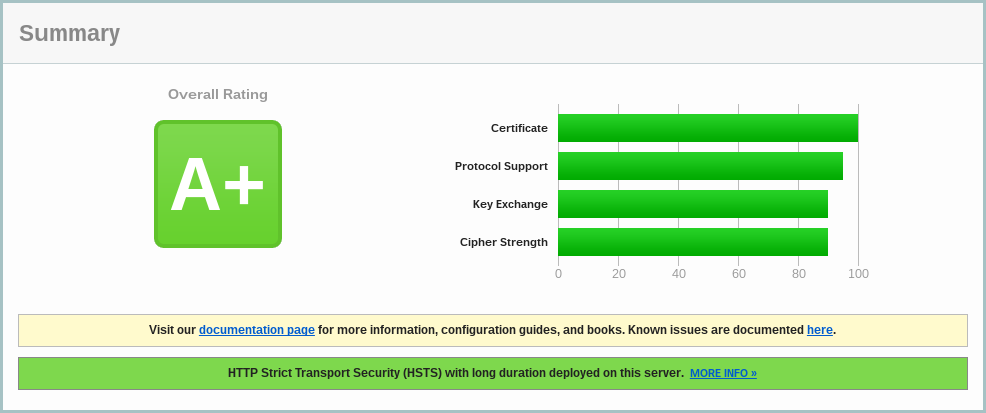

[Let's Encrypt](https://letsencrypt.org) adalah Certificate Authority (CA) yang gratis dan terotomatisasi yang berjalan untuk kepentingan umum. Let's Encrypt adalah sebuah layanan yang disediakan oleh Internet Security Research Group (ISRG). Prinsip-prinsip dasar dari Let's Encrypt adalah gratis, otomatis, aman, transparan, terbuka, dan koperatif.

## Instalasi Let's Encrypt

Instalasi Let's Encrypt

    sudo yum -y install git bc
    sudo git clone https://github.com/letsencrypt/letsencrypt /opt/letsencrypt

Buat sertifikat baru untuk domain example.com, sebelumnya hentikan dulu aplikasi Nginx

    sudo systemctl stop nginx
    cd /opt/letsencrypt
    ./letsencrypt-auto certonly --standalone -d example.com -d www.example.com -d mail.example.com
    ./letsencrypt-auto --help

Cek sertifikat yang dihasilkan

    sudo ls -l /etc/letsencrypt/live/example.com

Membuat Diffie-Hellman key

    sudo openssl dhparam -out /etc/ssl/certs/dhparam.pem 4096

## Nginx

Konfigurasi TLS/SSL di aplikasi Nginx

    sudo vi /etc/nginx/conf.d/ssl.conf
    # contoh konfigurasi
    server {
        listen 443 ssl;

        server_name example.com www.example.com;

        ssl_certificate /etc/letsencrypt/live/example.com/fullchain.pem;
        ssl_certificate_key /etc/letsencrypt/live/example.com/privkey.pem;

        # strong + backward compatibility
        ssl_protocols               TLSv1 TLSv1.1 TLSv1.2;
        ssl_prefer_server_ciphers   on;
        ssl_dhparam                 /etc/ssl/certs/dhparam.pem;
        ssl_ciphers                 'ECDHE-RSA-AES128-GCM-SHA256:ECDHE-ECDSA-AES128-GCM-SHA256:ECDHE-RSA-AES256-GCM-SHA384:ECDHE-ECDSA-AES256-GCM-SHA384:DHE-RSA-AES128-GCM-SHA256:DHE-DSS-AES128-GCM-SHA256:kEDH+AESGCM:ECDHE-RSA-AES128-SHA256:ECDHE-ECDSA-AES128-SHA256:ECDHE-RSA-AES128-SHA:ECDHE-ECDSA-AES128-SHA:ECDHE-RSA-AES256-SHA384:ECDHE-ECDSA-AES256-SHA384:ECDHE-RSA-AES256-SHA:ECDHE-ECDSA-AES256-SHA:DHE-RSA-AES128-SHA256:DHE-RSA-AES128-SHA:DHE-DSS-AES128-SHA256:DHE-RSA-AES256-SHA256:DHE-DSS-AES256-SHA:DHE-RSA-AES256-SHA:AES128-GCM-SHA256:AES256-GCM-SHA384:AES128-SHA256:AES256-SHA256:AES128-SHA:AES256-SHA:AES:CAMELLIA:DES-CBC3-SHA:!aNULL:!eNULL:!EXPORT:!DES:!RC4:!MD5:!PSK:!aECDH:!EDH-DSS-DES-CBC3-SHA:!EDH-RSA-DES-CBC3-SHA:!KRB5-DES-CBC3-SHA';
        ssl_session_timeout         10m;
        ssl_session_cache           shared:SSL:10m;
        ssl_ecdh_curve              secp384r1; # Requires nginx >= 1.1.0
        ssl_session_tickets         off; # Requires nginx >= 1.5.9
        ssl_stapling                on;
        ssl_stapling_verify         on;
        resolver                    $DNS1 $DNS2 valid=300s;
        resolver_timeout            5s;
        add_header                  Strict-Transport-Security "max-age=63072000; includeSubdomains; preload";
        add_header                  X-Frame-Options DENY;
        add_header                  X-Content-Type-Options nosniff;

        # The rest of your server block
        root /usr/share/nginx/html;
        index index.html index.htm;

        location / {
            # First attempt to serve request as file, then
            # as directory, then fall back to displaying a 404.
            try_files $uri $uri/ =404;
            # Uncomment to enable naxsi on this location
            # include /etc/nginx/naxsi.rules
        }
    }

Jalankan ulang Nginx

    sudo systemctl start nginx

Cek instalasi di website [SSL Labs](https://www.ssllabs.com/ssltest/analyze.html)

## Update sertifikat otomatis

Sertifikat Let's Encrypt hanya berlaku untuk 90 hari, akan tetapi direkomendasikan untuk melakukan update sertifikat setiap 60 hari untuk memberikan ruang untuk kesalahan. Berikut ini adalah perintah untuk melakukan update sertifikat.

    /opt/letsencrypt/letsencrypt-auto renew

Edit crontab untuk membuat job baru yang akan menjalankan perintah update setiap minggu.

    sudo crontab -e
    # contoh job
    30 2 * * 1 /opt/letsencrypt/letsencrypt-auto renew >> /var/log/le-renew.log
    35 2 * * 1 /usr/bin/systemctl reload nginx

## Update Let's Encrypt

Pull versi baru dari Github

    cd /opt/letsencrypt
    sudo git pull
